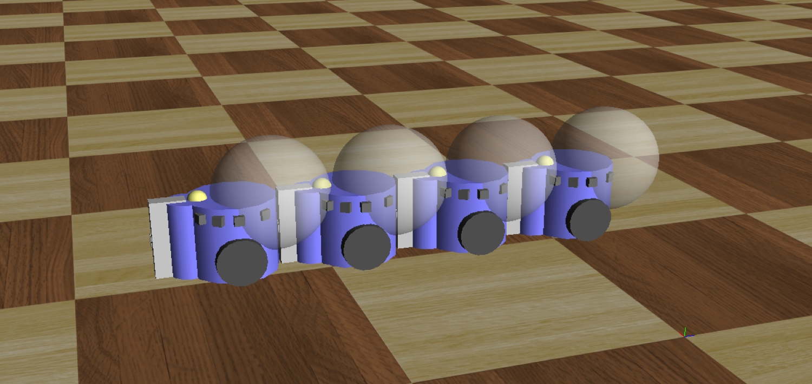
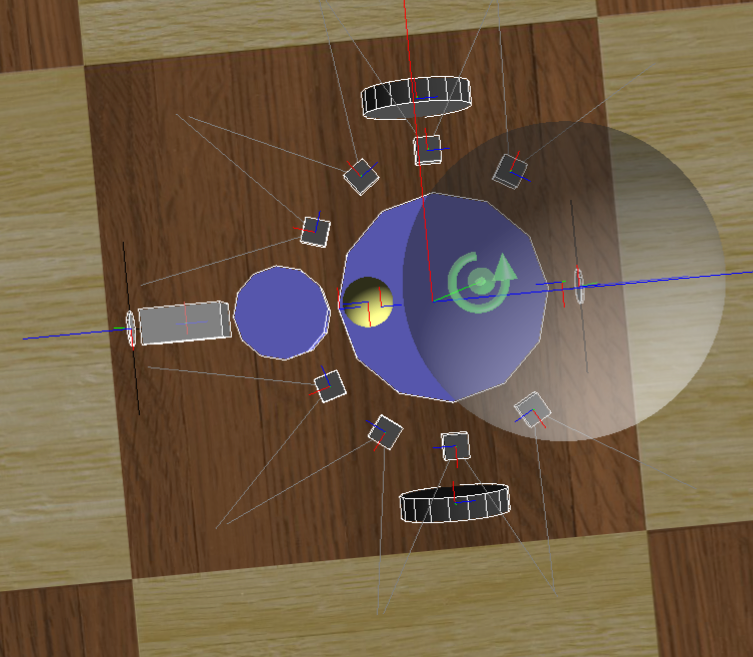

# Robot Control On Webots
Course project of *Introduction to Artificial Intelligence* at PKU

In this project, we designed a multi-robot system on Webots where a team of robots are instructed to perform a set of navigation and interaction tasks.

